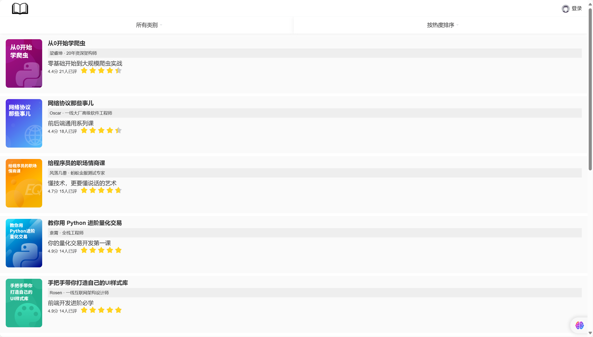
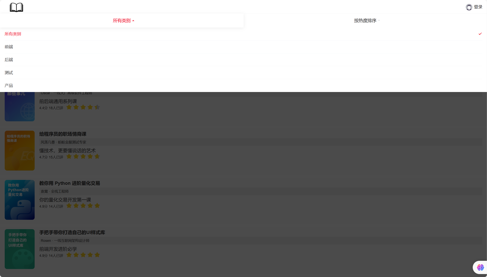
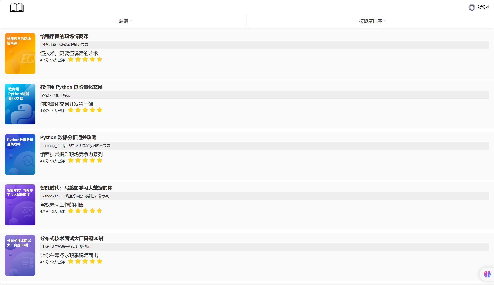
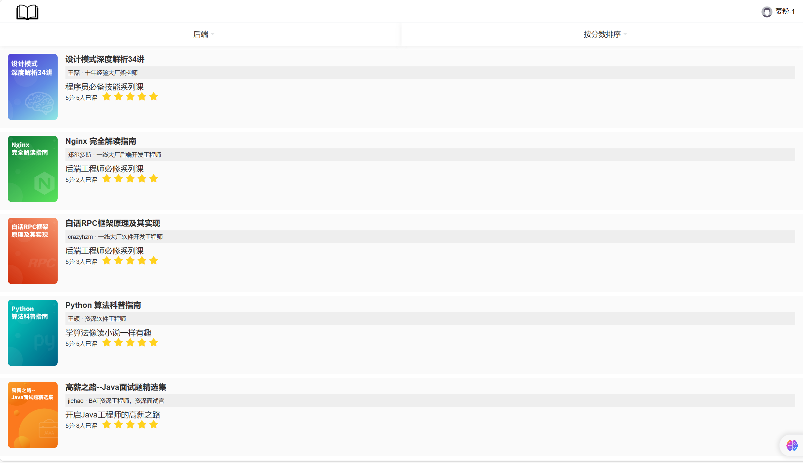
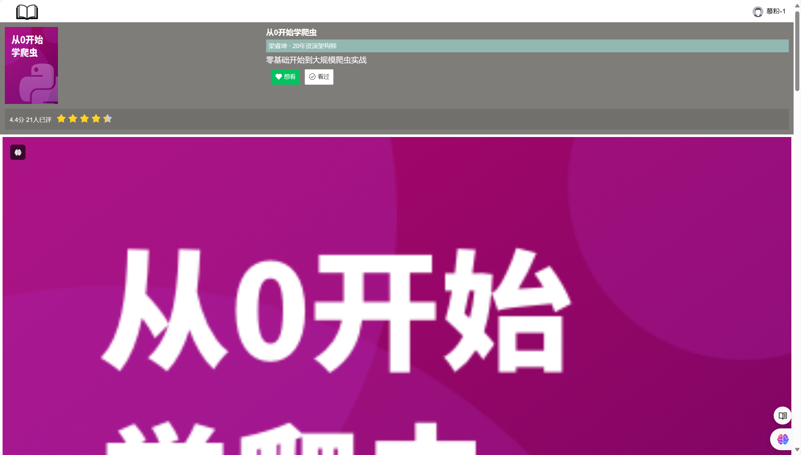
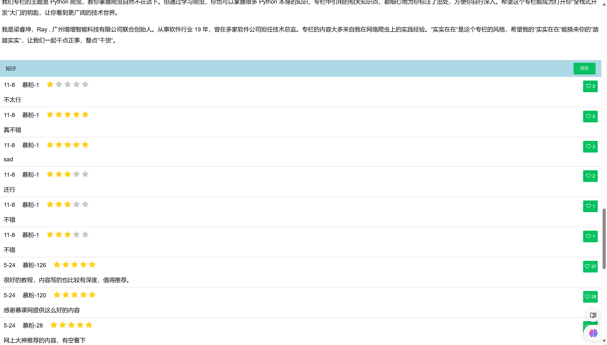
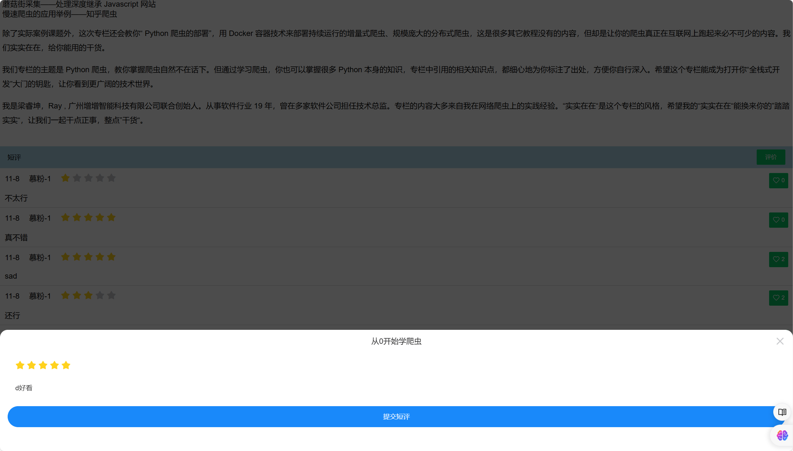
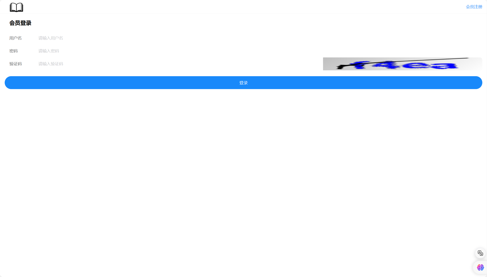

# 📚书评网
## 主页面
> 用户可以在主页面挑选书籍并对其进行评分，

> 可以根据不同类别以及其类别的热度或者分数来进行排序选择

## 书评页面
> 用户进入需要评价的书籍之后可以对此书籍进行标记“想看”或者“看过”，同时该页面基于spring-task设置了评论分数评价实时统计

> 用户能在此发表自己对该书籍的评论，也可看到其他用户的评论以及自己的评论

## 会员登陆页面
> 简单实现，注册页面一致

